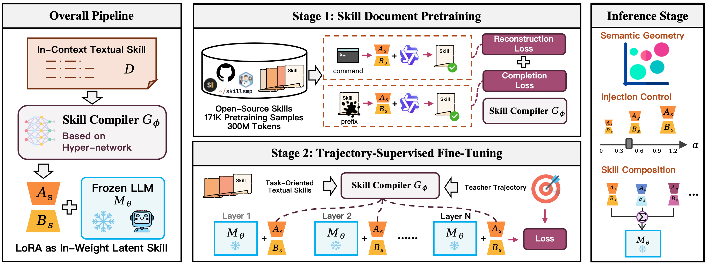
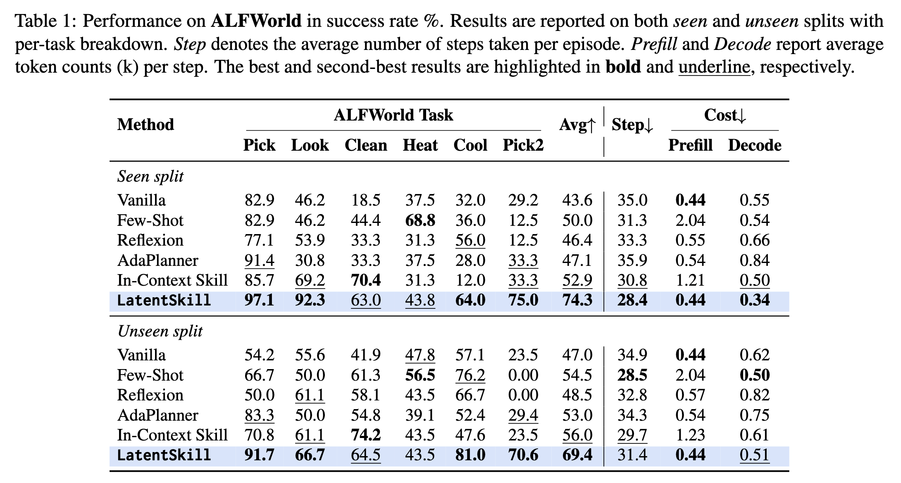
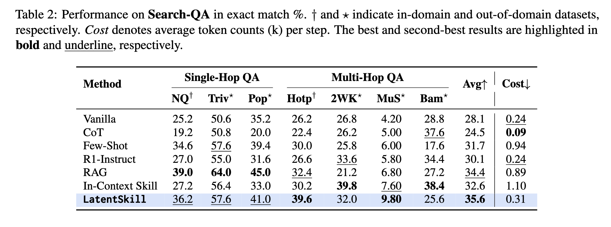

# LatentSkill: From In-Context Textual Skills to In-Weight Latent Skills for LLM Agents

<p align="center">
  <a href="https://arxiv.org/abs/2604.02029"></a>
  <a href="https://github.com/yuaofan0-oss/LatentSkill"></a>
  <a href="#"></a>
</p>

This is the official repository for the paper *"LatentSkill: From In-Context Textual Skills to In-Weight Latent Skills for LLM Agents"*.

[[Paper]](https://arxiv.org/abs/2604.02029)

## Overview

Agent systems increasingly rely on textual skills — reusable procedures that encode task strategies, tool-use patterns, and recovery heuristics — to solve complex tasks. However, injecting these skills into the prompt at every decision step incurs substantial context overhead and exposes skill content as plaintext.

**LatentSkill** addresses this by converting textual skills into plug-and-play LoRA adapters through a pretrained hypernetwork. Instead of delivering skills through the context window, LatentSkill stores skill knowledge in **weight space**, removing per-step skill tokens while preserving modular loading, scaling, and composition.

<p align="center">
  
</p>

<p align="center"><em>Figure: Overview of LatentSkill. Left: textual skills are transformed into in-weight latent skills through hypernetwork-based LoRA generation. Middle: the skill compiler is trained by skill document pretraining and trajectory-supervised fine-tuning. Right: the resulting latent skills support structured semantic geometry, controllable injection strength, and composable parameter-space arithmetic at inference time.</em></p>

## Key Findings

- **Zero Skill Tokens**: Skill knowledge is stored in LoRA weights rather than the prompt, reducing prefill overhead by up to 72.2%.
- **Plug-and-Play Modularity**: Generated skill LoRAs can be loaded, unloaded, replaced, or scaled without retraining the backbone.
- **Structured Weight Space**: Skill LoRAs form semantically meaningful clusters — skills from different domains are clearly separable in weight space.
- **Controllable Injection**: A continuous scaling coefficient α precisely modulates skill influence, following an interpretable inverted-U performance curve.
- **Composable Skills**: Skills can be combined through parameter-space arithmetic when decomposed into semantically aligned components.

## Main Results

### ALFWorld (Success Rate %)

<p align="center">
  
</p>

LatentSkill reaches **74.3%** and **69.4%** average success on the seen and unseen splits, improving over In-Context Skill by **+21.4** and **+13.4** points with **64.1% fewer prefill tokens**.

### Search-QA (Exact Match %)

<p align="center">
  
</p>

LatentSkill achieves the highest average EM of **35.6**, improving over In-Context Skill by **+3.0** points with **72.2% lower skill-token overhead**.

## Method

LatentSkill operates in two training stages:

1. **Skill Document Pretraining** — The hypernetwork-based skill compiler is pretrained on ~171K open-source skill documents (~300M tokens) crawled from GitHub. The compiler learns to map procedural text into LoRA adapter weights via reconstruction and completion objectives.

2. **Trajectory-Supervised Fine-Tuning** — The compiler is fine-tuned on teacher agent trajectories from ALFWorld and Search-QA, aligning generated LoRAs with task-level behavioral policies. The backbone LLM (Qwen3-8B) remains frozen throughout both stages.

At inference time, the compiler generates a skill-specific LoRA adapter in a single forward pass. The adapter is mounted on the frozen backbone, and the original skill text is never included in the prompt.

## Release

| Resource | Status |
|---|---|
| 📄 Paper | [Available](https://arxiv.org/abs/2604.02029) |
| 💻 Code | 🚧 Coming soon |
| 📦 Data | 🚧 Coming soon |
| 🏋️ Checkpoints | 🚧 Coming soon |

## Citation

If you find this work useful, please cite our paper:

```bibtex
@article{yu2025latentskill,
  title={LatentSkill: From In-Context Textual Skills to In-Weight Latent Skills for LLM Agents},
  author={Yu, Aofan and Zhou, Chenyu and Xu, Tianyi and Guo, Zihan and Shan, Rong and Fu, Zhihui and Wang, Jun and Liu, Weiwen and Yu, Yong and Zhang, Weinan and Lin, Jianghao},
  journal={arXiv preprint arXiv:2604.02029},
  year={2025}
}
```
